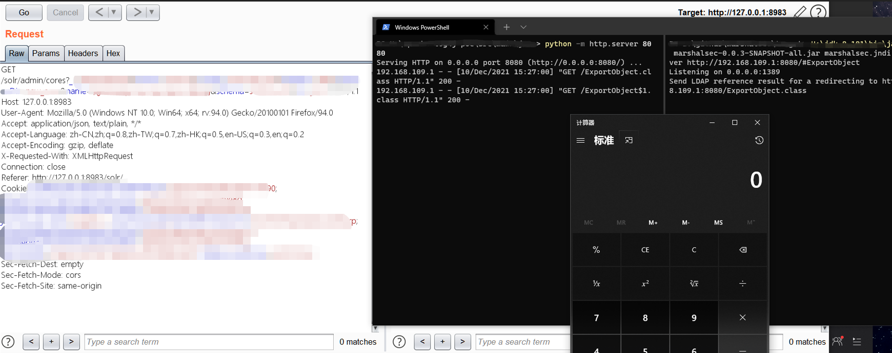
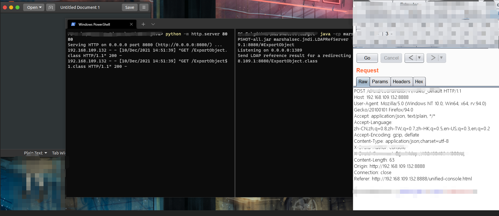
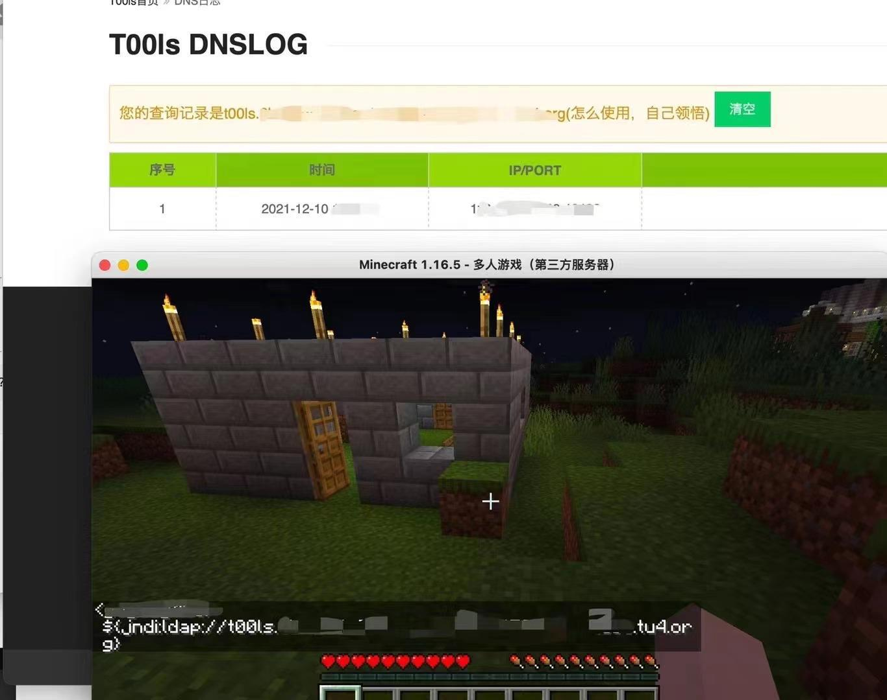

## 前言

Log4j2近日发现存在JNDI注入，因此有远程代码执行漏洞的风险。作为java开发中近似于基础开发的组件，其影响面是非常大的，甚至我们传入payload到其他语言的环境，只要这条数据能流入Log4j2也是会触发代码执行漏洞。

因为为了方便排查影响面，这里公开部分受影响的组件以及验证截图，欢迎大家一起提交mr完善受影响组件。

## 已知影响组件

#### Apache Solr

#### Apache Druid

#### Apache Flink

#### Apache Struts2

#### flume

#### dubbo

#### Redis

#### logstash

#### ElasticSearch

#### kafka

#### ghidra

#### 我的世界（Minecraft）

